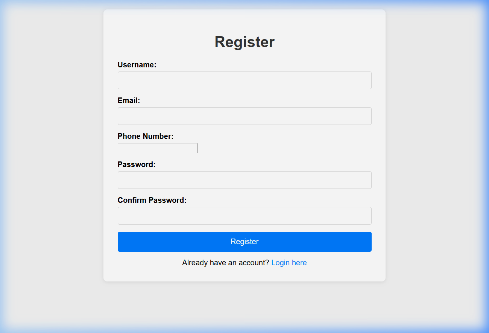
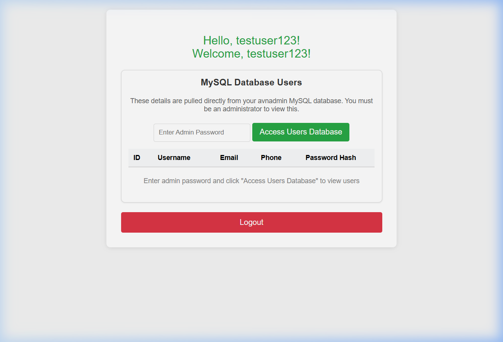

# 🔐 User Authentication & Database Management System

A production-ready Full-Stack User Authentication system featuring a Flask backend, responsive HTML5 frontend, and dual-database support (MySQL with SQLite fallback).

## 🚀 Live Output

### 📝 User Registration


### 📊 Admin Dashboard


---

## ✨ Features

- **Authentication**: Secure registration and login with `PBKDF2` password hashing.
- **Dual Database Support**: 
  - **Cold Storage**: Remote MySQL (Aiven Cloud) integration.
  - **Local Persistence**: Automatic SQLite fallback if the remote server is unreachable.
- **Admin Tools**: Secure `/users` endpoint for viewing current registrations.
- **Password Management**: Integrated "Forgot Password" and reset functionality.
- **Production Ready**: Served via `Waitress` WSGI for stability and performance.

---

## 🛠️ Technology Stack

- **Backend**: Python, Flask, Waitress (WSGI).
- **Frontend**: HTML5, CSS3 (Vanilla), JavaScript (ES6+).
- **Security**: Werkzeug Security for hashing.
- **Deployment**: Configured for Vercel & local production serving.

---

## 🏗️ Installation & Setup

### 1. Requirements
Ensure you have Python 3.8+ installed.

### 2. Clone and Install
```bash
git clone https://github.com/bennesangeeta-art/Database-application.git
cd Database-application/backend
pip install -r requirements.txt
```

### 3. Run Production Server (Windows)
Simply run the batch file in the root directory:
```bash
start_production.bat
```
Or manually:
```bash
cd backend
python run_production.py
```

### 4. Access the App
Open your browser and navigate to:
[http://localhost:5000](http://localhost:5000)

---

## 📁 Repository Structure

- `backend/`: Flask application, database logic, and production runners.
- `frontend/`: Static assets (index.html).
- `screenshots/`: Visual output of the application.
- `tests/`: Extensive Python test suite for validation and API checks.

---

## 🛡️ Security Note
The application uses environment variables for database credentials. Ensure your `.env` file is excluded from version control (already managed via `.gitignore`).